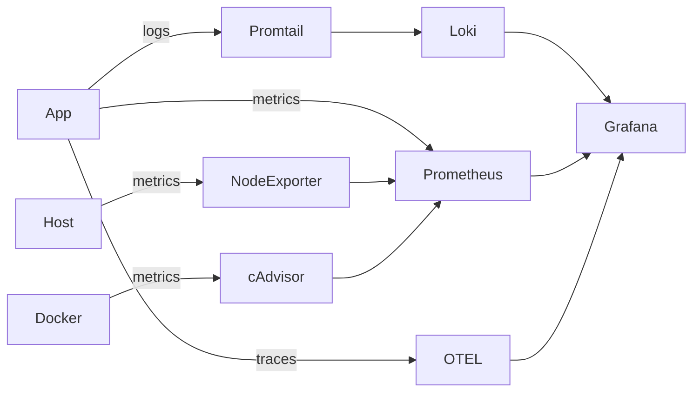

# Day 73 -- Introduction to Observability and Prometheus

### Task 1: Understand Observability
Research and write short notes on:

1. What is observability? How is it different from traditional monitoring?
   - **Monitoring** tells you _when_ something is wrong (alerts, thresholds)
   - **Observability** tells you _why_ something is wrong (explore, query, correlate)

2. The three pillars of observability:
   - **Metrics** -- numerical measurements over time (CPU usage, request count, error rate). Tools: Prometheus, Datadog, CloudWatch
   - **Logs** -- timestamped text records of events (application output, error messages). Tools: Loki, ELK Stack, Fluentd
   - **Traces** -- the journey of a single request across multiple services. Tools: OpenTelemetry, Jaeger, Zipkin

3. Why do DevOps engineers need all three?
   - Metrics tell you _what_ is broken (high error rate on `/api/users`)
   - Logs tell you _why_ it broke (stack trace showing a database timeout)
   - Traces tell you _where_ it broke (the payment service call took 12 seconds)

4. Draw or describe this architecture -- this is what you will build over the next 5 days:
   ```
   [Your App] --> metrics --> [Prometheus] --> [Grafana Dashboards]
   [Your App] --> logs    --> [Promtail]   --> [Loki] --> [Grafana]
   [Your App] --> traces  --> [OTEL Collector] --> [Grafana/Debug]
   [Host]     --> metrics --> [Node Exporter] --> [Prometheus]
   [Docker]   --> metrics --> [cAdvisor] --> [Prometheus]
   ```


[Your App] --> metrics --> [Prometheus] --> [Grafana Dashboards]

- App generates metrics like response time, CPU usage
- Prometheus collects and stores this data
- Grafana shows it as graphs and dashboards

[Your App] --> logs --> [Promtail] --> [Loki] --> [Grafana]

- App generates logs like "User logged in" or "Error occurred"
- Promtail collects logs from the app
- Loki stores the logs
- Grafana is used to search and view logs

[Your App] --> traces --> [OTEL Collector] --> [Grafana/Debug]

- Traces show how a request moves through the system
- Example: User request → API → Database → Response
- OTEL Collector processes the trace data
- Grafana visualizes the full request journey

[Host] --> metrics --> [Node Exporter] --> [Prometheus]

- Host machine is monitored for CPU, RAM, disk usage
- Node Exporter collects system metrics
- Prometheus stores this data

[Docker] --> metrics --> [cAdvisor] --> [Prometheus]

- Each Docker container is monitored individually
- cAdvisor collects container metrics
- Prometheus stores this data

---

### Task 2: Set Up Prometheus with Docker
Create a project directory for this entire observability block -- you will keep adding to it over the next 5 days.

```bash
mkdir observability-stack && cd observability-stack
```

Create a `prometheus.yml` configuration file:
```yaml
global:
  scrape_interval: 15s
  evaluation_interval: 15s

scrape_configs:
  - job_name: "prometheus"
    static_configs:
      - targets: ["localhost:9090"]
```

This tells Prometheus to scrape its own metrics every 15 seconds.

Create a `docker-compose.yml` to run Prometheus:
```yaml
services:
  prometheus:
    image: prom/prometheus:latest
    container_name: prometheus
    ports:
      - "9090:9090"
    volumes:
      - ./prometheus.yml:/etc/prometheus/prometheus.yml
      - prometheus_data:/prometheus
    command:
      - '--config.file=/etc/prometheus/prometheus.yml'
    restart: unless-stopped

volumes:
  prometheus_data:
```

Start Prometheus:
```bash
docker compose up -d
```

Open `http://localhost:9090` in your browser. You should see the Prometheus web UI.

**Verify:** Go to Status > Targets. You should see one target (`prometheus`) with state `UP`.
+ the prometheous is up

  


---

### Task 3: Understand Prometheus Concepts
Explore the Prometheus UI and understand these concepts:

1. **Scrape targets** -- endpoints that Prometheus pulls metrics from at regular intervals (pull-based model)
2. **Metrics types:**
   - `Counter` -- only goes up (total requests served, total errors)
   - `Gauge` -- goes up and down (current CPU usage, memory in use, active connections)
   - `Histogram` -- distribution of values in buckets (request duration: how many took <100ms, <500ms, <1s)
   - `Summary` -- similar to histogram but calculates percentiles on the client side
3. **Labels** -- key-value pairs that add dimensions to metrics (e.g., `http_requests_total{method="GET", status="200"}`)
4. **Time series** -- a unique combination of metric name + labels

Go to the Prometheus UI graph page (`http://localhost:9090/graph`) and run these queries:

```
# How many metrics is Prometheus collecting about itself?
count({__name__=~".+"})


# How much memory is Prometheus using?
process_resident_memory_bytes


# Total HTTP requests to the Prometheus server
prometheus_http_requests_total


# Break it down by handler
prometheus_http_requests_total{handler="/api/v1/query"}


```

**Document:** What is the difference between a counter and a gauge? Give one real-world example of each.

| Feature | Counter | Gauge |
|---------|---------|-------|
| Direction | Only goes up | Goes up and down |
| Measures | Total count of events | Current value at this moment |
| Can decrease? | No | Yes |
| Resets when? | Only on app restart | Never, always shows current value |
| Real-world example | Total HTTP requests received | Current CPU usage percentage |
| Another example | Total errors occurred | Current memory usage |
| Use case | How many times something happened | What is the value right now |

---
### Task 4: Learn PromQL Basics
PromQL (Prometheus Query Language) is how you ask questions about your metrics. Run these queries in the Prometheus UI:

1. **Instant vector** -- current value of a metric:
```promql
up
```


This returns 1 (up) or 0 (down) for each scrape target.

2. **Range vector** -- values over a time window:
```promql
prometheus_http_requests_total[5m]
```


Returns all values from the last 5 minutes.

3. **Rate** -- per-second rate of a counter over a time window:
```promql
rate(prometheus_http_requests_total[5m])
```


This is the most common function you will use. Counters always go up -- `rate()` converts them to a useful per-second speed.

4. **Aggregation** -- sum across all label combinations:
```promql
sum(rate(prometheus_http_requests_total[5m]))
```


5. **Filter by label:**
```promql
prometheus_http_requests_total{code="200"}
prometheus_http_requests_total{code!="200"}
```


6. **Arithmetic:**
```promql
process_resident_memory_bytes / 1024 / 1024
```
This converts bytes to megabytes.


7. **Top-K:**
```promql
topk(5, prometheus_http_requests_total)
```


**Try this exercise:** Write a PromQL query that shows the per-second rate of non-200 HTTP requests to Prometheus over the last 5 minutes. (Hint: use `rate()` with a label filter on `code!="200"`)
```promql
rate(http_requests_total{code!="200"}[5m])
```

---
### Task 5: Add a Sample Application as a Scrape Target
Prometheus needs something to monitor. Add a simple metrics-generating service.

Update your `docker-compose.yml` to include a sample app that exposes Prometheus metrics:
```yaml
services:
  prometheus:
    image: prom/prometheus:latest
    container_name: prometheus
    ports:
      - "9090:9090"
    volumes:
      - ./prometheus.yml:/etc/prometheus/prometheus.yml
      - prometheus_data:/prometheus
    command:
      - '--config.file=/etc/prometheus/prometheus.yml'
    restart: unless-stopped

  notes-app:
    image: trainwithshubham/notes-app:latest
    container_name: notes-app
    ports:
      - "8000:8000"
    restart: unless-stopped

volumes:
  prometheus_data:
```

Update `prometheus.yml` to scrape the app:
```yaml
global:
  scrape_interval: 15s
  evaluation_interval: 15s

scrape_configs:
  - job_name: "prometheus"
    static_configs:
      - targets: ["localhost:9090"]

  - job_name: "notes-app"
    static_configs:
      - targets: ["notes-app:8000"]
```

Restart the stack:
```bash
docker compose up -d
```

Go back to Status > Targets. You should now see two targets. Generate some traffic to the app:
```bash
curl http://localhost:8000
curl http://localhost:8000
curl http://localhost:8000
```

**Note:** Not all applications expose Prometheus metrics natively. In later days you will learn how Node Exporter, cAdvisor, and OTEL Collector act as metric exporters for systems that do not have built-in Prometheus support.


---

### Task 6: Explore Data Retention and Storage
Understand how Prometheus stores data:

1. Check how much disk space Prometheus is using:
```bash
docker exec prometheus du -sh /prometheus
```

2. Prometheus stores data in a local time-series database (TSDB). Default retention is 15 days. You can change it:
```yaml
command:
  - '--config.file=/etc/prometheus/prometheus.yml'
  - '--storage.tsdb.retention.time=30d'
  - '--storage.tsdb.retention.size=1GB'
```

3. Check the TSDB status in the UI: Status > TSDB Status

**Document:** What happens when retention is exceeded? Why is a volume mount important for Prometheus data?

### Retention in simple words:
Prometheus stores data for a fixed time period.
The default retention period is 15 days.
After 15 days, old data is automatically deleted.

### What happens step by step:

| Step | What happens |
|------|-------------|
| Day 1-15 | Data is stored safely in Prometheus |
| Day 16 | Oldest data starts getting deleted automatically |
| Day 17+ | Prometheus keeps deleting old data to make space |
| Always | Only last 15 days of data is available |

### Simple example:
- You had a server crash on Day 1
- It is now Day 16
- You go to Grafana to check what happened on Day 1
- The data is GONE - Prometheus already deleted it
- You cannot investigate the crash anymore

---

## Why is a Volume Mount Important for Prometheus?

### Without volume mount:

| Situation | What happens |
|-----------|-------------|
| Prometheus container restarts | ALL data is lost forever |
| Docker is restarted | ALL data is lost forever |
| Server reboots | ALL data is lost forever |
| You update Prometheus | ALL data is lost forever |

### With volume mount:

| Situation | What happens |
|-----------|-------------|
| Prometheus container restarts | Data is safe, nothing lost |
| Docker is restarted | Data is safe, nothing lost |
| Server reboots | Data is safe, nothing lost |
| You update Prometheus | Data is safe, nothing lost |

### How volume mount works in simple words:
- Normally Docker stores data INSIDE the container
- When container dies, data dies with it
- Volume mount stores data OUTSIDE the container on your host machine
- Container can die and restart but data stays safe on disk

### One line summary:
- Retention = controls HOW LONG data is kept
- Volume mount = controls WHETHER data survives a restart
---


